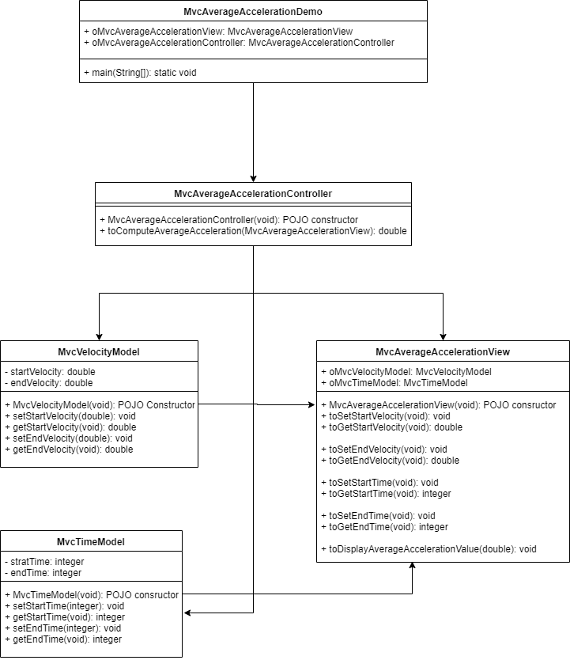

> #### Prog : Write a program that prompts the user to enter the starting velocity v0 in meters/second, the ending velocity v1 in meters/second, and the time span t in seconds, and displays the average acceleration.

> # Algorithm :
	1. user inputs for start velocity(v0), end velocity(v1) and taken time duration(t)
	2. calculate the average acceleration using below formula
			a = (v1 - v0)/t
	3. publish the result average acceleration value

=======================================================================
	
	
> # Flow Chart Diagram :

=======================================================================

> # CRC cards :

=======================================================================

> # UML Diagram

=======================================================================
