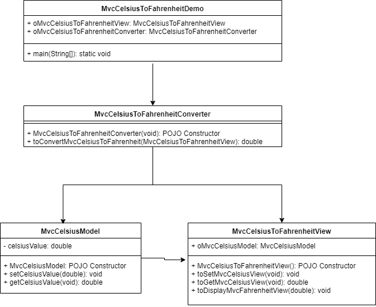

### Prog : Write a program that reads a Celsius degree in a double value from the console, then converts it to Fahrenheit and displays the result.

> # Algorithm :  
    1. Read Celsius input from user  
    2. Convert celsius into fahrenheit using below formula  
    		fahrenheit = (9 / 5) * celsius + 32  
    3. Publish equivalent fahrenheit value
    
> # UML Design :

