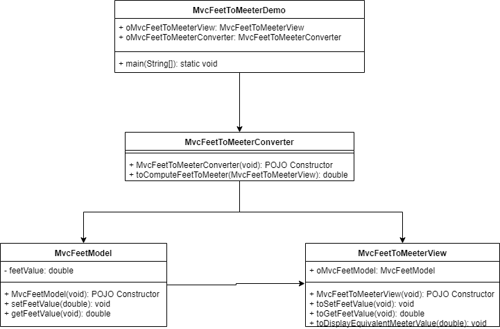

> #### Prog : Write a program that reads a number in feet, converts it to meters, and displays the result. 

> # Algorithm :  
	1. read user inputs for feet
	2. convert the feet value into meters using below formula
		1 foot = 0.305 meter
	3. publish the result in meters
	
=========================================================================

> # Algorithm Flow chart :

=========================================================================

> # CRC Cards :  

=========================================================================

> # UML Design :  
