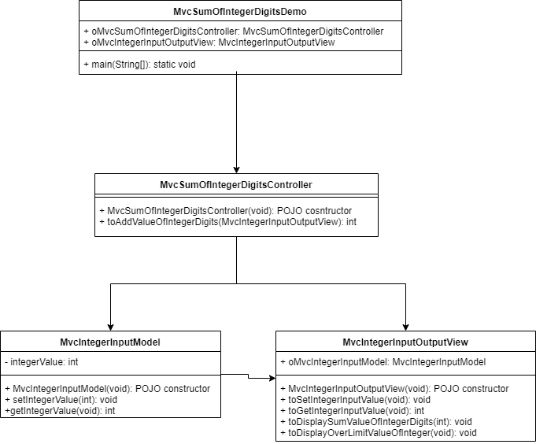

> ### Prog :Write a program that reads an integer between 0 and 1000 and adds all the digits in the integer.

> # Algorithm :
	1. read an integer as user input
	2. calculate sum of digits in integer. For example :
		remainder = integer%10  //932%10 = 2 // 93%10 = 3 // 9%10 = 9
		temp = integer/10       //932/10 = 93 // 93/10 = 9 // 9/10 = 0
		integer = temp		
		sum = sum+remainder // 0+2+3+9
	3. publish summation result
	
=========================================================================================

> # Flow Chart Diagram :

	
=========================================================================================

> # UML Design : 

	
=========================================================================================
