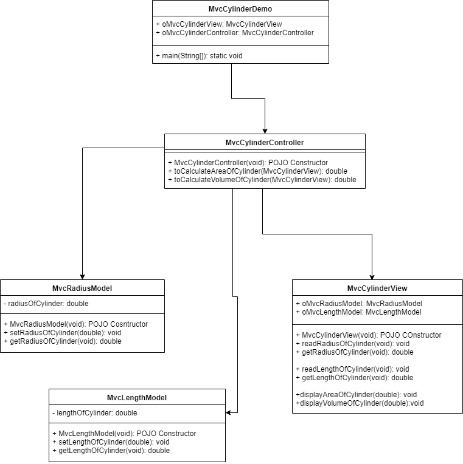

## Prog : Write a program that reads in the radius and length of a cylinder and computes the area and volume.  
  
> # Algorithm :  
	1. read the radius and length of  cylinder.  
	2. compute the area and volume using below formula.    
			area = radius * radius * PI  
			volume = area * length  
	3. publish the result.  

==============================================	
> # Flowchart Design :   
  
	

==============================================	
> # UML Design :  

	 